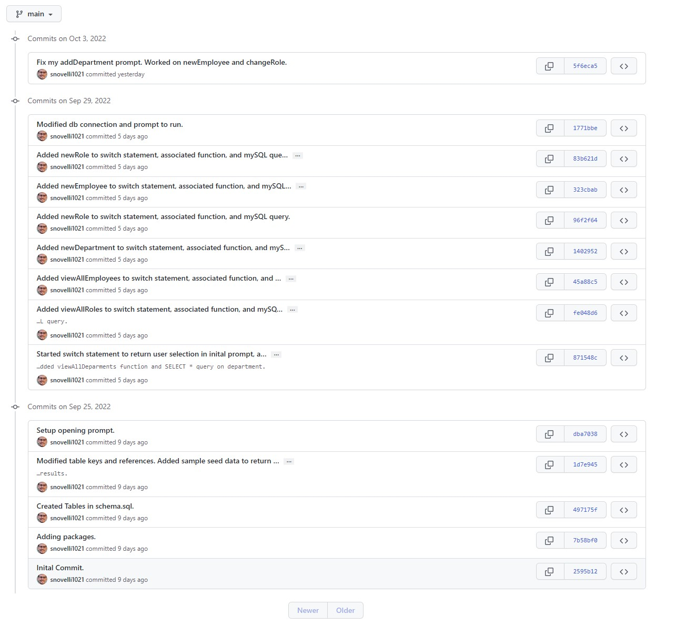

UW Coding Bootcamp Module 12 Challenge: SQL Challenge, Employee Tracker.

This application uses mysql commands and queries to view and modify data in a database. There are 3 tables that hold data which have joins built by primary key and foreign key. The Inquirer package is used to prompt user's on if they want to view or modify the records in a specific table.

Github Repo: https://github.com/snovelli1021/EmployeeTrackerSQL

Recorded Video: https://drive.google.com/file/d/1xEt2x8vJN9DcNrYfo27auBIz_kwXToGZ/view

PLEASE SEE THE SCREENSHOT BELOW:
Halfway through the assignment I noticed I didn't put my db name and password as environmental variables and had already made commits to GitHub. I since deleted the repo and added the files into a new one, the screenshot shows the previous commit history from my old repo.

